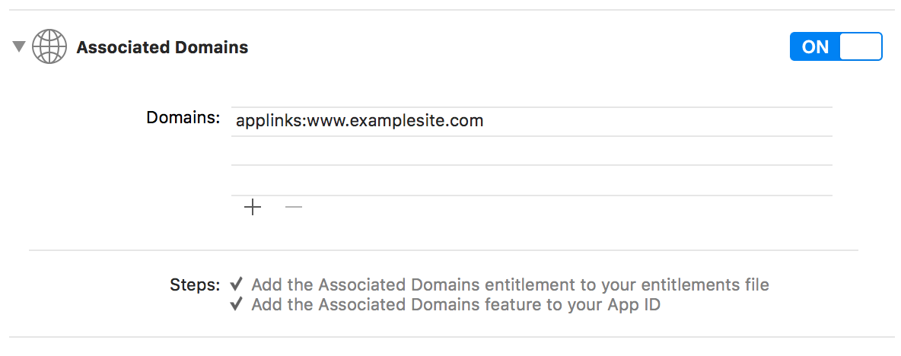
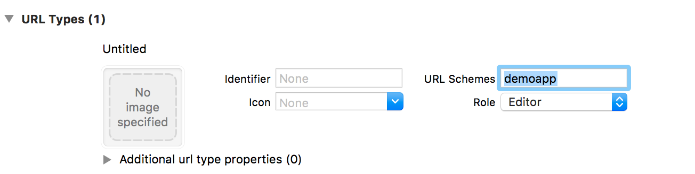
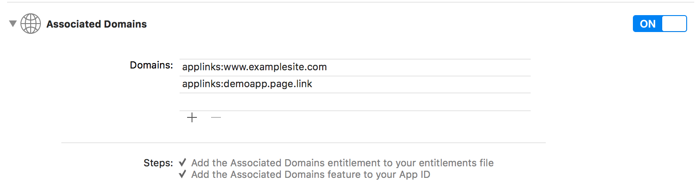

# Firebase Dynamic Links
Official link https://firebase.google.com/docs/dynamic-links/

To support Firebase Dynamic Links it was necessary to manage Universal Links and Deeplinks. The implementation is inspired by the plugins [cordova-universal-links-plugin](https://github.com/nordnet/cordova-universal-links-plugin) and [cordova-plugin-customurlscheme](https://github.com/EddyVerbruggen/Custom-URL-scheme). When configured, the javascript function `handleOpenUrl` will be called after the app is started.

### Configuration iOS
- Enabled the capabilities *Associated Domains* and add the domains. Ex. `applinks:www.examplesite.com`

- Under Info tab add the *URL Types* for enabled custom url scheme.


### Configuration Android
Edit AndroidManifest.xml:

- For Universal links:
```xml
<intent-filter android:autoVerify="true">
	<action android:name="android.intent.action.VIEW" />
	<category android:name="android.intent.category.DEFAULT" />
	<category android:name="android.intent.category.BROWSABLE" />
	<data android:host="www.examplesite.com" android:scheme="http" />
	<data android:host="www.examplesite.com" android:scheme="https" />
</intent-filter>
```

- For Custom url
```xml
<intent-filter android:autoVerify="true">
	<action android:name="android.intent.action.VIEW" />
	<category android:name="android.intent.category.DEFAULT" />
	<category android:name="android.intent.category.BROWSABLE" />
	<data android:scheme="demoapp" />
</intent-filter>
```


### Usage:

```js
window.handleOpenURL = function handleOpenURL(url) {
	setTimeout(function(url){
		alert(url);
	}, 0);
}
```

## Firebase Dynamic links
They are like the Universal links. The Dynamic Link will be processed by the Firebase library which will send the tracking information automatically. At the end the JS function `handleOpenUrl` will be called with url.

### Configuration iOS
Enabled the capabilities *Associated Domains* and add the domains. Ex. `applinks:demoapp.page.link`, is the subdomain created in the Firebase panel.


### Configuration Android
Edit AndroidManifest.xml:

```xml
<intent-filter android:autoVerify="true">
	<action android:name="android.intent.action.VIEW" />
	<category android:name="android.intent.category.DEFAULT" />
	<category android:name="android.intent.category.BROWSABLE" />
	<data android:host="demoapp.page.link" android:scheme="http" />
	<data android:host="demoapp.page.link" android:scheme="https" />
</intent-filter>
```

## Enable debug view for Analytics and Dynamic Links

[Documentation Firebase](https://firebase.google.com/docs/analytics/debugview)
