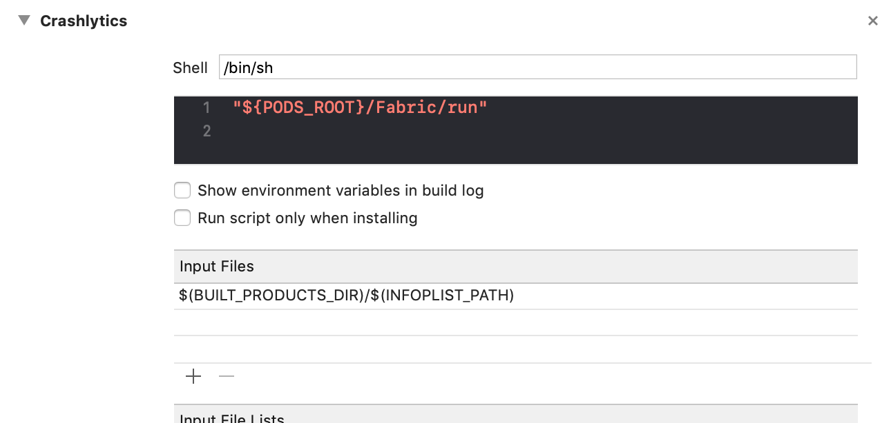
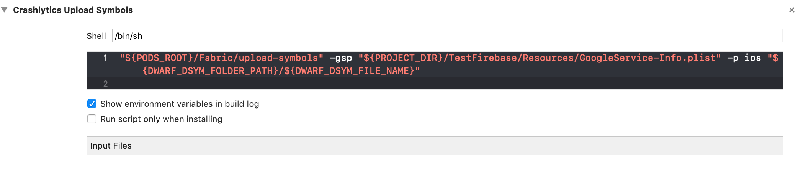

# Get started

Install the plugin with Cordova cli:

```shell
$ cordova plugin add cordova-plugin-firebase --save
```

### Setup
Download your Firebase configuration files, **GoogleService-Info.plist** for iOS and **google-services.json** for android, and place them in the root folder of your cordova project.  Check out this [firebase article](https://support.google.com/firebase/answer/7016592) for details on how to download the files.

```
- My Project/
    platforms/
    plugins/
    www/
    config.xml
    google-services.json       <--
    GoogleService-Info.plist   <--
    ...
```

###### IMPORTANT NOTES
- This plugin uses a hook (after prepare) that copies the configuration files to the right place, namely `platforms/ios/\<My Project\>/Resources` for iOS and `platforms/android` for Android.
- Firebase SDK requires the configuration files to be present and valid, otherwise your app will crash on boot or Firebase features won't work.

### iOS
To install the Firebase SDKs, I recommend using the CocoaPods repo. For this it is necessary to install the plugin **cordova-plugin-cocoapod-support**. It is not set as a dependency because it is at your discretion whether to use Pods.

```shell
$ cordova plugin add cordova-plugin-cocoapod-support --save
```

In your **config.xml** enter the dependencies. The **spec** attributes indicates the version of the SDK. Check the latest version available from the officials website https://cocoapods.org/pods/Firebase and https://firebase.google.com/docs/ios/setup.

```xml
<platform name="ios">
	...
	<preference name="pods_ios_min_version" value="7.0" /> <!-- Set the min iOS version. Default is 7.0  -->
	<preference name="pods_use_frameworks" value="true" />
	<pod name="Firebase/Core" version="5.18.0" />
	<pod name="Firebase/Auth" version="5.18.0" />
	<pod name="Firebase/Messaging" version="5.18.0" />
	<pod name="Firebase/Performance" version="5.18.0" />
	<pod name="Firebase/RemoteConfig" version="5.18.0" />
	<pod name="Firebase/DynamicLinks" version="5.18.0" />
	<pod name="Fabric" version="1.9.0" />
	<pod name="Crashlytics" version="3.12.0" />
</platform>
```

##### Add the Crashlytics run script
Script's run  **Crashlytics**:
1. Open your project in Xcode, and select its project file in the Navigator.
2. Select your main build target from the **Select a project or target** dropdown.
3. Open the target's **Build Phases** tab.
4. Click **+ Add a new build phase**, and select New Run Script Phase.
5. Add the following line to the **Type a script...** text box:
```shell
"${PODS_ROOT}/Fabric/run"
```
6. **Xcode 10 only:** Add your app's built Info.plist location to the Build Phase's **Input Files** field:
```shell
$(BUILT_PRODUCTS_DIR)/$(INFOPLIST_PATH)
```


<br>
Script's **Crashlytics Upload Symbols** (dSYM file):<br>
Official documentation: https://firebase.google.com/docs/crashlytics/get-deobfuscated-reports?authuser=0

1. Open your project in Xcode, and select its project file in the Navigator.
2. Select your main build target from the **Select a project or target** dropdown.
3. Open the target's **Build Phases** tab.
4. Click **+ Add a new build phase**, and select New Run Script Phase.
5. Add the following line to the **Type a script...** text box:

```shell
"${PODS_ROOT}/Fabric/upload-symbols" -gsp "${PROJECT_DIR}/<TARGET_NAME>/Resources/GoogleService-Info.plist" -p ios "${DWARF_DSYM_FOLDER_PATH}/${DWARF_DSYM_FILE_NAME}"
```
Note: replace **<TARGET_NAME>** with the name of target.


<br><br>
#### Integrate without CocoaPods

1. Download the [framework SDK zip](https://firebase.google.com/download/ios) (this is a ~500MB file and may take some time).
2. Unzip and see the README file for which Frameworks to include in to your project. The list of SDK:
	1. FirebaseCore.framework
	2. FirebaseAuth.framework
	3. FirebaseMessaging.framework
	4. FirebasePerformance.framework
	5. FirebaseRemoteConfig.framework
	6. FirebaseDynamicLinks.framework
3. Add the [ObjC](https://developer.apple.com/library/content/qa/qa1490/_index.html) linker flag in your **Other Linker Settings** in your target's build settings.
4. Fabric & Crashlytics SDK https://fabric.io/kits/ios/crashlytics/manual-install

##### Add the Crashlytics run script
```shell
"${PROJECT_DIR}/Fabric.framework/run"
```
<br><br>

### Android

If you want to update or change version of frameworks it is possible to add customized tags inside the config.xml. A hook set the new versions after the prepare. These settings are not mandatory because they are by default in the plugin. This stratagem helps us to update the addiction libraries without waiting for a new release of the plugin.

```xml
<platform name="android">
	...
	<dependency-classpath name="com.android.tools.build:gradle:3.3.0" />
	<dependency-classpath name="com.google.gms:google-services:4.2.0" />
	<dependency-classpath name="io.fabric.tools:gradle:1.26.1" />

	<framework-implementation name="com.google.firebase:firebase-core:16.0.7" />
	<framework-implementation name="com.google.firebase:firebase-auth:16.1.0" />
	<framework-implementation name="com.google.firebase:firebase-messaging:17.3.4" />
	<framework-implementation name="com.google.firebase:firebase-config:16.1.3" />
	<framework-implementation name="com.google.firebase:firebase-perf:16.2.3" />
	<framework-implementation name="com.google.firebase:firebase-dynamic-links:16.1.5" />
	<framework-implementation name="com.google.android.gms:play-services-tagmanager:16.0.7" />
	<framework-implementation name="com.crashlytics.sdk.android:crashlytics:2.9.8" />
	...
</platform>
```
